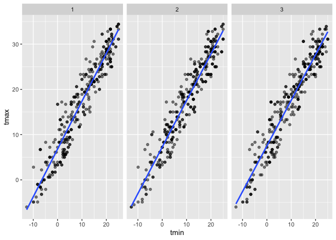

Homework 6
================
Xiangyi Liu (xl3048)
11/30/2020

``` r
library(tidyverse)
library(modelr)
library(p8105.datasets)
library(mgcv)
library(broom)
```

## Problem 1

``` r
homicide_df = 
  read_csv("data/homicide-data.csv", na = c("", "NA", "Unknown")) %>% 
  mutate(
    city_state = str_c(city, state, sep = ", "),
    victim_age = as.numeric(victim_age),
    resolution = case_when(
      disposition == "Closed without arrest" ~ 0,
      disposition == "Open/No arrest"        ~ 0,
      disposition == "Closed by arrest"      ~ 1)
  ) %>% 
  filter(
    victim_race %in% c("White", "Black"),
    city_state != "Tulsa, AL") %>% 
  select(city_state, resolution, victim_age, victim_race, victim_sex)
```

Start with one city.

``` r
baltimore_df =
  homicide_df %>% 
  filter(city_state == "Baltimore, MD")

glm(resolution ~ victim_age + victim_race + victim_sex, 
    data = baltimore_df,
    family = binomial()) %>% 
  broom::tidy() %>% 
  mutate(
    OR = exp(estimate),
    CI_lower = exp(estimate - 1.96 * std.error),
    CI_upper = exp(estimate + 1.96 * std.error)
  ) %>% 
  select(term, OR, starts_with("CI")) %>% 
  knitr::kable(digits = 3)
```

| term              |    OR | CI\_lower | CI\_upper |
| :---------------- | ----: | --------: | --------: |
| (Intercept)       | 1.363 |     0.975 |     1.907 |
| victim\_age       | 0.993 |     0.987 |     1.000 |
| victim\_raceWhite | 2.320 |     1.648 |     3.268 |
| victim\_sexMale   | 0.426 |     0.325 |     0.558 |

Try this across cities.

``` r
models_results_df = 
  homicide_df %>% 
  nest(data = -city_state) %>% 
  mutate(
    models = 
      map(.x = data, ~glm(resolution ~ victim_age + victim_race + victim_sex, data = .x, family = binomial())),
    results = map(models, broom::tidy)
  ) %>% 
  select(city_state, results) %>% 
  unnest(results) %>% 
  mutate(
    OR = exp(estimate),
    CI_lower = exp(estimate - 1.96 * std.error),
    CI_upper = exp(estimate + 1.96 * std.error)
  ) %>% 
  select(city_state, term, OR, starts_with("CI")) 
```

``` r
models_results_df %>% 
  filter(term == "victim_sexMale") %>% 
  mutate(city_state = fct_reorder(city_state, OR)) %>% 
  ggplot(aes(x = city_state, y = OR)) + 
  geom_point() + 
  geom_errorbar(aes(ymin = CI_lower, ymax = CI_upper)) + 
  theme(axis.text.x = element_text(angle = 90, hjust = 1))
```

<!-- -->

## Problem 2

``` r
bwt_df <- read.csv("./data/birthweight.csv") %>% drop_na() %>%
  mutate(
    babysex = as.factor(babysex),
    frace = as.factor(frace),
    malform = as.factor(malform),
    mrace = as.factor(mrace)
  )
```

``` r
mod_null <- lm(bwt ~ bhead + blength + babysex + bhead*blength + bhead*babysex + blength*babysex,data = bwt_df)
my_mod <- lm(bwt ~ bhead + blength + babysex + bhead*blength + bhead*babysex + blength*babysex  + smoken + pnumlbw+fincome+ppbmi+fincome*ppbmi, data = bwt_df)

anova(mod_null, my_mod) %>% 
  broom::tidy()
```

    ## # A tibble: 2 x 6
    ##   res.df        rss    df    sumsq statistic   p.value
    ##    <dbl>      <dbl> <dbl>    <dbl>     <dbl>     <dbl>
    ## 1   4335 359931888.    NA      NA       NA   NA       
    ## 2   4331 353764466.     4 6167422.      18.9  2.12e-15

I began the problem by first looking at the performance of Model 1 and
Model 2 (specified in the problem) and plot their RMSE using violin
plot. Found out Model 2 had lower RMSE and performed better than Model
1.  
Thus, I built my own model based on predictors included in Model 2. I
tried a couple of combinations of predictors that I hypothesized to have
indicative ability to birth weight and used ANOVA to compare two nested
model.  
The null hypothesis is the full (my model) and the reduced model (Model
2) do not differ significantly; the alternative hypothesis is the full
model is significantly better.  
The p-value shown in the ANOVA summary table above is very low (reject
H0), meaning my model has significantly better performance than Model 2.

``` r
resid <- add_residuals(data = bwt_df, model = my_mod) %>% select(resid)
p<-add_predictions(data = bwt_df, model = my_mod) %>% cbind(resid) %>%
  select(pred,resid) %>%
  ggplot(aes(x = pred, y = resid)) + geom_point(color = "lightblue")+
  labs(title = "Residual vs Fitted Values", x = "Fitted Values", y= "Residuals")
p
```

<!-- -->
Looks like the majority of residuals clustered in the range between
-1000 to 1000. This may be caused by the original dataset does not
uniformly distributed.  
Zoom in the plot…

``` r
p+xlim(1500,4500) + ylim(-1500,1500)
```

    ## Warning: Removed 25 rows containing missing values (geom_point).

<!-- -->

As we expect to see, residual values bounce around zero (expected value
is 0); residuals form a horizontal band around zero: above and below
(indication of equal variance).

``` r
cv_df = crossv_mc(bwt_df, 5) 

cv_df =
  cv_df %>% 
  mutate(
    train = map(train, as_tibble),
    test = map(test, as_tibble))

cv_df = 
  cv_df %>% 
  mutate(
    mod_1  = map(.x=train, ~lm(bwt ~ blength+gaweeks, data = .x)),
    mod_2  = map(.x=train, ~lm(bwt ~ bhead + blength + babysex + bhead*blength + bhead*babysex + blength*babysex, data = .x)),
    mod_3 = map(.x=train, ~my_mod, data = .x)
    ) %>% 
  mutate(
    rmse_1 = map2_dbl(.x=mod_1, .y=test, ~rmse(model = .x, data = .y)),
    rmse_2 = map2_dbl(.x=mod_2, .y=test, ~rmse(model = .x, data = .y)),
    rmse_my = map2_dbl(.x = mod_3, .y=test, ~rmse(model = .x, data = .y))
    )
cv_df %>% select(starts_with("rmse_"))%>%knitr::kable(digits = 3)
```

| rmse\_1 | rmse\_2 | rmse\_my |
| ------: | ------: | -------: |
| 326.296 | 291.884 |  285.841 |
| 337.121 | 289.208 |  285.386 |
| 326.814 | 288.189 |  285.822 |
| 347.101 | 299.122 |  292.915 |
| 327.786 | 277.353 |  276.020 |

``` r
cv_df %>% 
  select(starts_with("rmse")) %>% 
  pivot_longer(
    everything(),
    names_to = "model", 
    values_to = "rmse",
    names_prefix = "rmse_") %>% 
  mutate(model = fct_inorder(model)) %>% 
  ggplot(aes(x = model, y = rmse,color = model)) + geom_violin()+
  labs(title = "Model Comparison")
```

<!-- -->

Model 1: using length at birth and gestational age as predictors (main
effects only)  
Model 2: using head circumference, length, sex, and all interactions
(including the three-way interaction) between these  
My Model: besides variables (and their interactions) used in Model 2, I
added smoking status (*smoken*), previous number of low birth weight
babies (*pnumlbw*), family monthly income (*fincome*), mother’s
pre-pregnancy BMI (*ppbmi*), and the interaction between *fincome* and
*ppbmi*.Smoking status of mother during pregnancy is a crucial factor on
the health of the baby, so I decided to include it in the model. Also,
the family income is relevant to the health and weight of the mother,
and sequentially the health and weight of the new born. The family
income should have some interaction with mother’s BMI before pregnancy.

## Problem 3

``` r
weather_df = 
  rnoaa::meteo_pull_monitors(
    c("USW00094728"),
    var = c("PRCP", "TMIN", "TMAX"), 
    date_min = "2017-01-01",
    date_max = "2017-12-31") %>%
  mutate(
    name = recode(id, USW00094728 = "CentralPark_NY"),
    tmin = tmin / 10,
    tmax = tmax / 10) %>%
  select(name, id, everything())
```

``` r
boot_sample = function(df) {
  sample_frac(df, replace = TRUE)
}

boot_straps = 
  data_frame(
    strap_number = 1:5000,
    strap_sample = rerun(5000, boot_sample(weather_df))
  )
```

    ## Warning: `data_frame()` is deprecated as of tibble 1.1.0.
    ## Please use `tibble()` instead.
    ## This warning is displayed once every 8 hours.
    ## Call `lifecycle::last_warnings()` to see where this warning was generated.

``` r
boot_straps
```

    ## # A tibble: 5,000 x 2
    ##    strap_number strap_sample      
    ##           <int> <list>            
    ##  1            1 <tibble [365 × 6]>
    ##  2            2 <tibble [365 × 6]>
    ##  3            3 <tibble [365 × 6]>
    ##  4            4 <tibble [365 × 6]>
    ##  5            5 <tibble [365 × 6]>
    ##  6            6 <tibble [365 × 6]>
    ##  7            7 <tibble [365 × 6]>
    ##  8            8 <tibble [365 × 6]>
    ##  9            9 <tibble [365 × 6]>
    ## 10           10 <tibble [365 × 6]>
    ## # … with 4,990 more rows

Make some plot to do a quick check on bootstrap samples.

``` r
boot_straps %>% 
  filter(strap_number %in% 1:3) %>% 
  unnest(strap_sample) %>% 
  ggplot(aes(x = tmin, y = tmax)) + 
  geom_point(alpha = .5) +
  stat_smooth(method = "lm", se = FALSE) +
  facet_grid(~strap_number) 
```

    ## `geom_smooth()` using formula 'y ~ x'

<!-- -->
That looks about right. In comparison with the original data, the
bootstrap sample has the same characteristics but isn’t a perfect
duplicate – some original data points appear more than once, others
don’t appear at all.

``` r
bootstrap_results = 
  boot_straps %>% 
  mutate(
    models = map(strap_sample, ~lm(tmax ~ tmin, data = .x) ),
    results = map(models, broom::tidy)) %>% 
  select(-strap_sample)

bootstrap_coeff <- map(.x = bootstrap_results$models, ~glance(.x))

r_sqr<-sapply(bootstrap_coeff, "[[", 1) 


bootstrap_results = bootstrap_results %>%
  select(-models) %>% 
  unnest(results) 


bootstrap_results %>% 
  group_by(term) %>% 
  summarize(boot_se = sd(estimate)) %>% 
  knitr::kable(digits = 3)
```

    ## `summarise()` ungrouping output (override with `.groups` argument)

| term        | boot\_se |
| :---------- | -------: |
| (Intercept) |    0.253 |
| tmin        |    0.017 |

``` r
log_val<- bootstrap_results %>%
  select(strap_number,term, estimate) %>%
  pivot_wider(
    names_from = term,
    values_from = estimate
  ) %>%
  mutate(
    log_value = log(`(Intercept)`*tmin)
  ) %>% select(log_value)
```

``` r
r_sqr <- as.data.frame(r_sqr)
ggplot(r_sqr, aes(x=r_sqr)) + 
    geom_density(alpha=.2, fill="#FF6666")+
  labs(title = "Distribution of R-Squared", x= "R-Squared")
```

<!-- -->

``` r
log_val %>% ggplot(aes(x=log_value))+ 
    geom_density(alpha=.2, fill="lightblue")+
  labs(title = "Distribution of log(b^1*b^0)", x= "log(b^1*b^0)")
```

<!-- -->

The distribution of 5000 r-squared (mean slightly above 0.91) and
log(b^1\*b^0) (mean slightly above 2.00) values from 5000 bootstrap
samples is fairly normal.

``` r
ci <- data.frame(
  x = c(quantile(as.data.frame(r_sqr)$r_sqr, 0.025), quantile(as.data.frame(r_sqr)$r_sqr, 0.975)),
  y = c(quantile(log_val$log_value, 0.025), quantile(log_val$log_value, 0.975))
)

rownames(ci) <- c("ci_lower","ci_upper")
colnames(ci) <- c("r-squared", "log(b^1 * b^0)")

ci %>%  knitr::kable(digits = 3)
```

|           | r-squared | log(b^1 \* b^0) |
| :-------- | --------: | --------------: |
| ci\_lower |     0.894 |           1.963 |
| ci\_upper |     0.927 |           2.059 |
